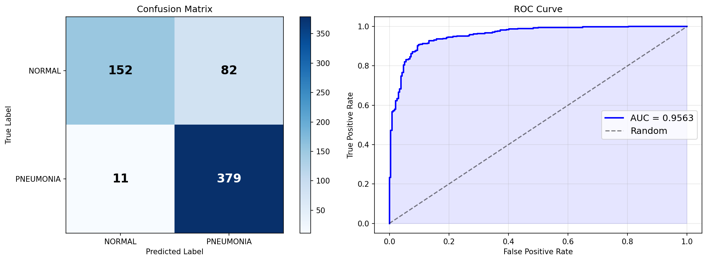
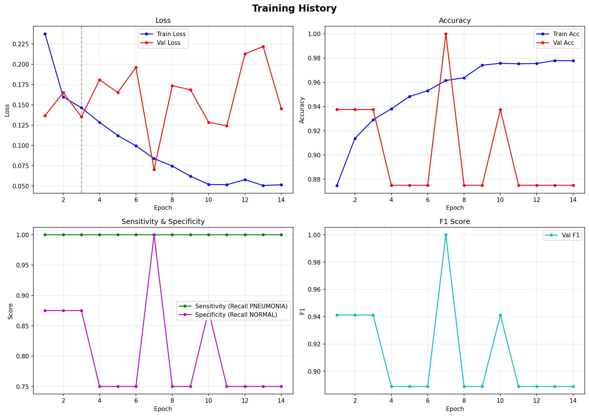

# Scientia API

REST API untuk deteksi pneumonia dari citra X-Ray dada menggunakan DenseNet binary classification dengan preprocessing CLAHE.

## Teknologi

- **FastAPI** — web framework modern dan cepat
- **Uvicorn** — ASGI server production-ready
- **PyTorch + TorchVision** — inference model DenseNet
- **Pillow + OpenCV** — preprocessing gambar (CLAHE, denoise)

## Struktur

```
api/
├── app.py                    # Entry point FastAPI
├── .env                      # Environment variables (copy dari .env.example)
├── .env.example              # Template konfigurasi
├── requirements.txt          # Daftar dependencies
└── models/
    ├── config.py             # Konfigurasi model
    ├── model.py              # Arsitektur model
    ├── predict.py            # Inference module
    ├── preprocess.py         # Image preprocessing
    └── checkpoints/
        ├── best_model.pth         # Model terbaik dari training
        └── inference_model.pth    # Model untuk deployment (opsional)
```

## Setup & Menjalankan

### 1. Persiapan Environment

```bash
# Buat virtual environment (opsional tapi direkomendasikan)
python3 -m venv venv
source venv/bin/activate  # Di Windows: venv\Scripts\activate
```

### 2. Install Dependencies

```bash
# Install semua requirements
pip install -r requirements.txt
```

### 3. Konfigurasi Environment

```bash
# Copy .env.example ke .env
cp .env.example .env

# Edit .env jika perlu (default sudah sesuai)
nano .env
```

Konfigurasi di `.env`:
```env
DATA_ROOT="models/data/chest_xray"
CHECKPOINT_DIR="models/checkpoints"
DEVICE="cpu"           # Gunakan "cuda" jika ada GPU
NUM_WORKERS="2"
THRESHOLD="0.5"        # Threshold klasifikasi
```

### 4. Pastikan Model Tersedia

Pastikan file model sudah ada di salah satu lokasi berikut:
- `models/checkpoints/inference_model.pth` (prioritas utama)
- `models/checkpoints/best_model.pth` (fallback)

Jika belum ada, jalankan training terlebih dahulu atau download model yang sudah di-training.

### 5. Jalankan Server

```bash
# Development mode (auto-reload)
uvicorn app:app --reload --port 8000 --host 127.0.0.1

# Production mode
uvicorn app:app --port 8000 --host 0.0.0.0 --workers 4
```

Server berjalan di `http://127.0.0.1:8000`

## Endpoints

| Method | Endpoint   | Deskripsi                        |
|--------|------------|----------------------------------|
| GET    | `/`        | Status API                       |
| GET    | `/health`  | Cek status server & model        |
| POST   | `/predict` | Upload gambar → hasil prediksi   |

### GET `/`

**Response:**
```json
{
  "message": "Scientia Pneumonia Detection API is running",
  "status": "ok"
}
```

### GET `/health`

**Response:**
```json
{
  "status": "ok",
  "model_loaded": true,
  "mode": "real"
}
```

- `model_loaded`: `true` jika model berhasil dimuat, `false` jika tidak
- `mode`: `"real"` (model aktif) atau `"dummy"` (mode testing)

### POST `/predict`

**Request:** `multipart/form-data`
- `file` — file gambar JPEG/PNG, maksimal 10 MB

**Response (mode real):**
```json
{
  "filename": "xray.jpg",
  "mode": "real",
  "label": "PNEUMONIA",
  "confidence": 0.9234,
  "probabilities": {
    "NORMAL": 0.0766,
    "PNEUMONIA": 0.9234
  },
  "inference_time_ms": 45.23
}
```

**Response (mode dummy - jika model tidak tersedia):**
```json
{
  "filename": "xray.jpg",
  "mode": "dummy",
  "label": "NORMAL",
  "confidence": 0.8734,
  "probabilities": {
    "NORMAL": 0.8734,
    "PNEUMONIA": 0.1266
  }
}
```

**Error Responses:**

- **400 Bad Request** — File bukan gambar atau rusak
  ```json
  {"detail": "File harus berupa gambar (JPEG/PNG)."}
  ```

- **400 Bad Request** — File terlalu besar
  ```json
  {"detail": "Ukuran file maksimal 10 MB."}
  ```

## Testing API

### Swagger UI (Interactive Docs)

Buka di browser: **`http://127.0.0.1:8000/docs`**

Di sini Anda bisa:
- Melihat semua endpoint
- Test endpoint langsung dari browser
- Upload gambar untuk testing

### ReDoc (Alternative Docs)

Buka di browser: **`http://127.0.0.1:8000/redoc`**

### Via cURL

```bash
# Test health check
curl http://127.0.0.1:8000/health

# Test predict dengan file gambar
curl -X POST http://127.0.0.1:8000/predict \
  -F "file=@/path/ke/chest_xray.jpg"
```

### Via Python (requests)

```python
import requests

# Upload gambar untuk prediksi
with open("chest_xray.jpg", "rb") as f:
    files = {"file": f}
    response = requests.post(
        "http://127.0.0.1:8000/predict",
        files=files
    )
    print(response.json())
```

### Via httpie

```bash
# Install httpie: pip install httpie
http --form POST http://127.0.0.1:8000/predict file@chest_xray.jpg
```

## Model Details

- **Arsitektur:** DenseNet-121 (pretrained ImageNet)
- **Input:** 224×224 RGB (converted dari grayscale)
- **Preprocessing:**
  - CLAHE (Contrast Limited Adaptive Histogram Equalization)
  - Gaussian blur untuk denoise
  - Centre crop 90%
  - ImageNet normalization
- **Output:** Binary classification (NORMAL vs PNEUMONIA)
- **Threshold default:** 0.5 (dapat dikonfigurasi via .env)

## Troubleshooting

### Model tidak ter-load

**Gejala:** Mode API menunjukkan `"dummy"` di `/health`

**Solusi:**
1. Pastikan file model ada di `models/checkpoints/best_model.pth` atau `inference_model.pth`
2. Periksa log saat server start untuk error message
3. Periksa path di file `.env` sudah benar
4. Pastikan model compatible dengan kode (DenseNet-121, binary output)

### Import Error

**Gejala:** Error saat import module models

**Solusi:**
1. Pastikan file `models/__init__.py` ada (bisa kosong)
2. Jalankan uvicorn dari direktori `api/`
3. Cek PYTHONPATH

### CUDA/GPU Issues

**Gejala:** Error "CUDA out of memory" atau device error

**Solusi:**
1. Ubah `DEVICE="cpu"` di file `.env`
2. Restart server

### Slow Inference

**Solusi:**
1. Gunakan GPU jika tersedia: `DEVICE="cuda"` di `.env`
2. Pastikan menggunakan `inference_model.pth` (optimized)
3. Untuk production, gunakan multiple workers: `--workers 4`

## Production Deployment

### Menggunakan Gunicorn + Uvicorn

```bash
pip install gunicorn

gunicorn app:app \
  --workers 4 \
  --worker-class uvicorn.workers.UvicornWorker \
  --bind 0.0.0.0:8000 \
  --timeout 120
```

### Menggunakan Docker (coming soon)

```dockerfile
# Dockerfile akan ditambahkan
```

### Models Results
 
 

## License

MIT License


